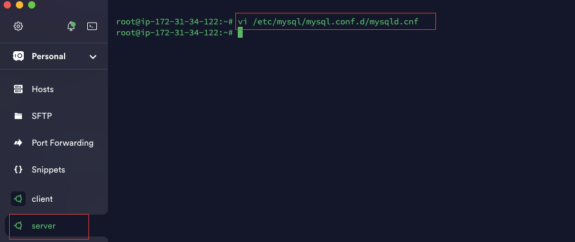

# ClientServer

## Understanding Client server architecture with MySQL as RDBMS

### Project Task - Implement a Client Server Architecture using MySQL Database Management System (DBMS)

#### For this task I will aim to  create and configure 2 linux based  virtual servers (EC2 instances in AWS). One named 'MYSQLSERVER' and the other named 'MYSQLCLIENT'. On the first one I'd install mySQLserver software and the second I'd install mySQL Client software. Then use IP address of MYSQLSERVER to connect from MYSQLCLIENT

Step 1
Create an instance EC2 instance and name it `MYSQLCLIENT`

##### Note - the security group of the instance is shown below

The instance should have inbound rules allowing access only on necessary port (port 22) for management purposes.

Step 3

Open Ubuntu and connect. Then update using `apt update`

Step 4 

Install mysql client using `apt install mysql  client`

Step 5
Create an instance EC2 instance and name it `MYSQLSERVER`

##### Note - the security group of the instance is shown below. This MUST not be the same as the security group of the MYSQLCLIENT

Step 6
Create a security group allowing inbound traffic on port 3306 from the specific local IP address of MYSQLCLIENT ( Note -ensure you select "MySQL/Aurora" from the "Type" dropdown menu.)

Step 7

Open Ubuntu and connect. Then update using `apt update`

Step 8

Install mysql server using `apt install mysql  server`

Step 9 

Configure MySQL Server: On the MYSQLSERVER instance, ensure MySQL is configured to allow remote connections by editing the MySQL configuration.
Open this in the editor as shown below

Step 10 
Once in, find the line bind-address and change it to 0.0.0.0 to bind MySQL to all available network interfaces.- Save and exit the editor

Step 11

On `MYSQLSERVER` log in to MySQL and create a new user with password, and grant the user the neccessary priveleges

Step 12

On `MYSQLCLIENT` server connect to the`MYSQLSERVER` remotely as shown below;

